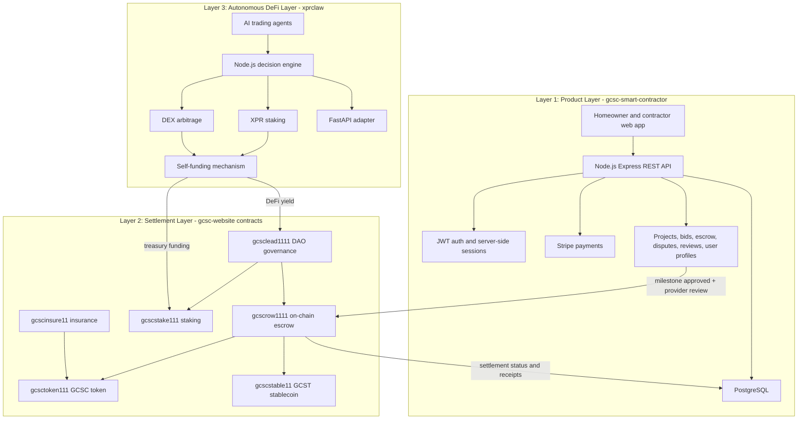

# GCSC Smart Contractor Architecture

GCSC Smart Contractor is a three-layer system: a product marketplace, an on-chain settlement layer, and an autonomous DeFi funding layer. The product layer owns user workflows. The settlement layer owns tokenized money movement and governance. The DeFi layer generates protocol yield and treasury support.

## Layer 1: Product Layer

Repository: `gcsc-smart-contractor`

The product layer is the customer-facing marketplace. It handles account creation, login, user profiles, contractor and homeowner roles, project creation, bid submission, escrow records, disputes, reviews, Stripe payments, and REST API access.

Core components:

- Node.js Express backend in `v3/server.js`
- PostgreSQL persistence in `v3/database/`
- REST modules in `v3/routes/`
- Shared verified JWT middleware in `v3/middleware/auth.js`
- Stripe payment routes for deposits, platform fees, and payout workflows
- Project, bid, escrow, dispute, review, and verification workflows

Layer 1 should be treated as the operational source of truth for UX state: project descriptions, bids, messages, review records, dispute files, and provider review outcomes.

## Layer 2: Settlement Layer

Repository: `gcsc-website`

The settlement layer runs on XPR Network smart contracts. It should only receive finalized, reviewed settlement instructions from Layer 1. It records token movement, escrow status, governance decisions, staking, insurance, and stablecoin reserve constraints.

Core contracts:

- `gcscrow1111`: milestone escrow funding, approval, release, dispute, cancellation
- `gcsctoken111`: GCSC governance and utility token
- `gcscstable11`: GCST reserve-limited stablecoin
- `gcsclead1111`: DAO governance proposals and voting
- `gcscstake111`: staking mechanics
- `gcscinsure11`: policy and claim workflows

Layer 2 should be treated as the settlement source of truth: token balances, escrow releases, DAO execution records, staking state, and insurance payouts.

## Layer 3: Autonomous DeFi Layer

Repository area: `xprclaw`

The autonomous DeFi layer is a treasury-support system. It uses AI trading agents, XPR staking, DEX arbitrage, a self-funding mechanism, a FastAPI adapter, and a Node.js decision engine to produce yield and treasury inflows.

Layer 3 must not directly control customer escrow funds. Its output should feed treasury and staking contracts through guarded DAO-controlled flows.

## Layer Movement Rules

Movement from Layer 1 to Layer 2 happens only after a marketplace event is ready for settlement. The main trigger is: milestone approved in Layer 1 plus provider review passed. That event creates an on-chain settlement call to `gcscrow1111`, which releases the approved milestone amount to the contractor.

Movement from Layer 2 to Layer 1 happens through settlement receipts, transaction hashes, escrow status reads, and event indexing. Layer 1 stores these references in PostgreSQL for dashboards, customer support, disputes, and audit trails.

Movement from Layer 3 to Layer 2 happens when DeFi yield is available. Yield from `xprclaw` feeds DAO treasury and staking flows in Layer 2. Treasury movement should be governed, logged, and separated from homeowner escrow deposits.

## Boundary Rules

- Layer 1 can prepare settlement instructions, but Layer 2 executes final token movement.
- Layer 2 can emit receipts and statuses, but Layer 1 owns customer-facing workflow state.
- Layer 3 can generate yield, but it must not custody or trade homeowner escrow funds.
- Stripe and XPR settlement should stay reconciled by project, milestone, user, amount, and transaction hash.
- Every real-money action needs idempotency keys, audit logs, and a retry-safe status machine.
